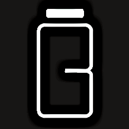
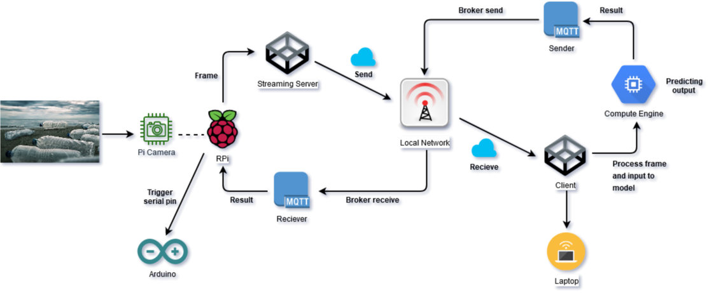
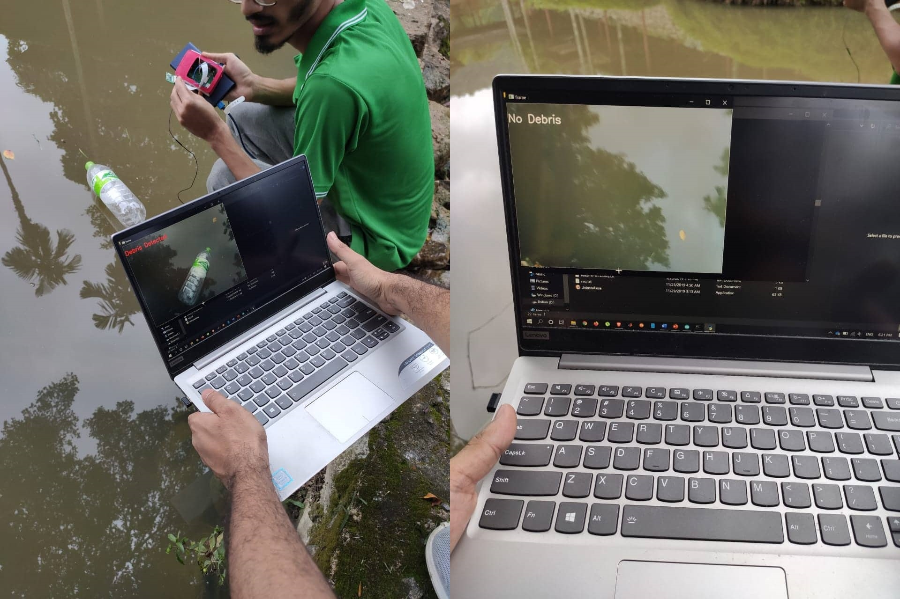

# Bottler
A server-client based bottle classifier attached with a robot to clean bottles from sea.

## System Structure


## Hardwares
```
- Raspberry PI 3B
- PI camera module
- Arduino
```
## Dependencies
```
- tensorflow
- opencv-python
- numpy
- paho-mqtt
- RPi.GPIO
```
## Usage
#### For streaming PI camera module as a server run following command -
``` python
    $ python stream_vfeed.py
```
#### To predict from the stream as a client run -
``` python
    $ python predict.py
```
#### Send data to arduino run -
``` python
    $ python to_arduino.py
```
## Demo Photo
 
